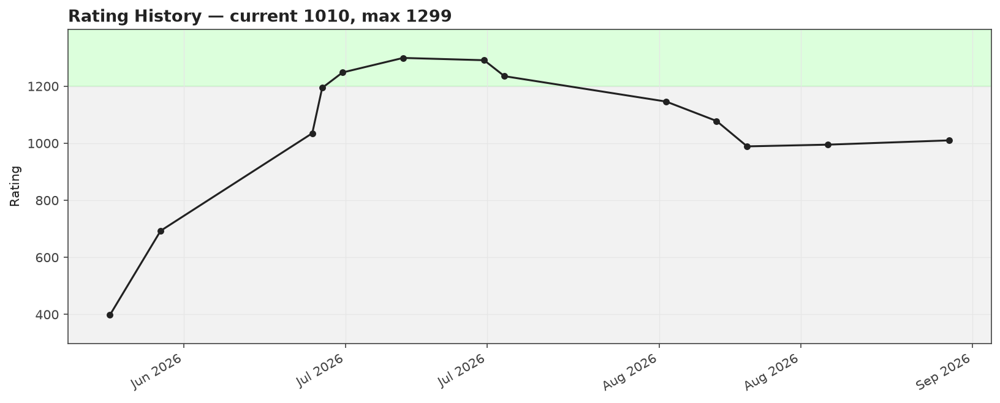
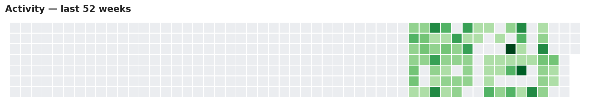
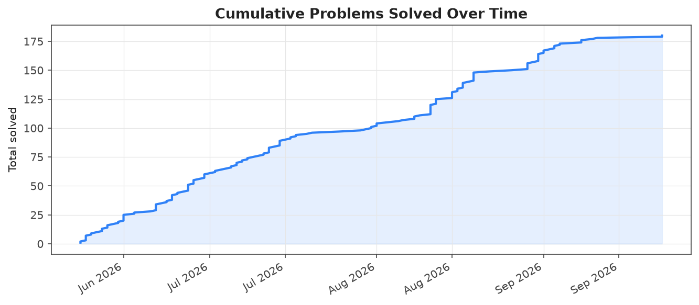
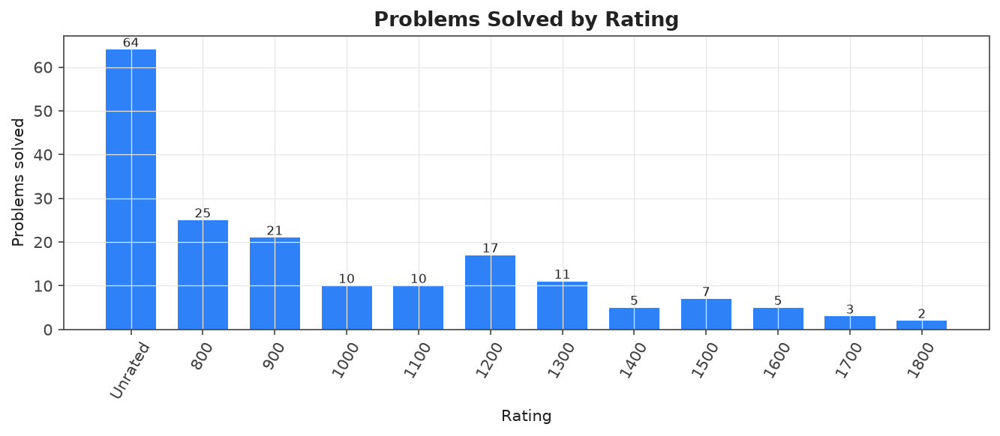
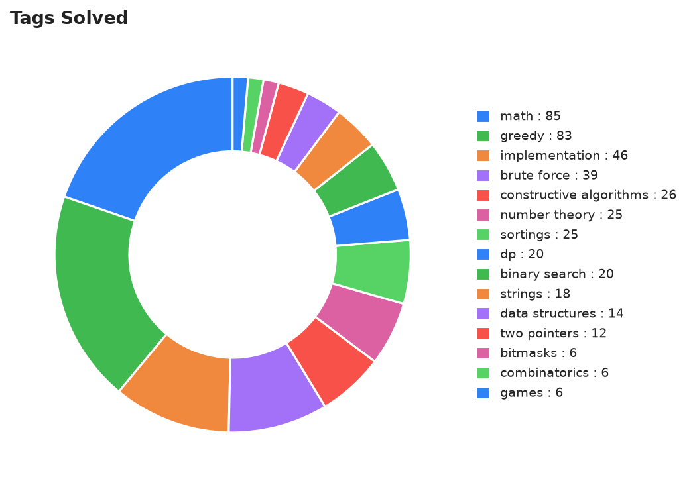
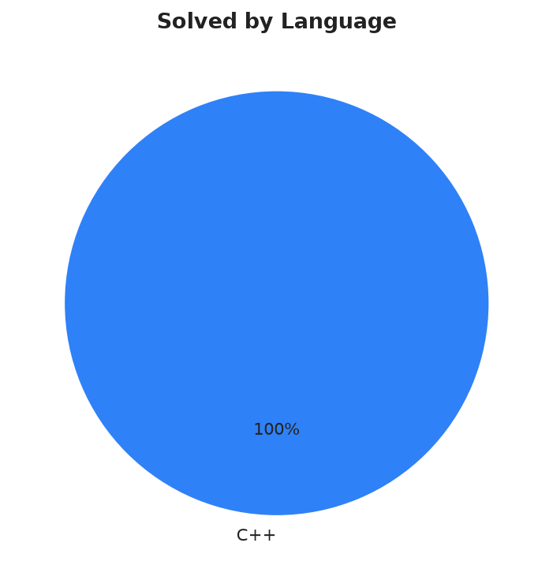
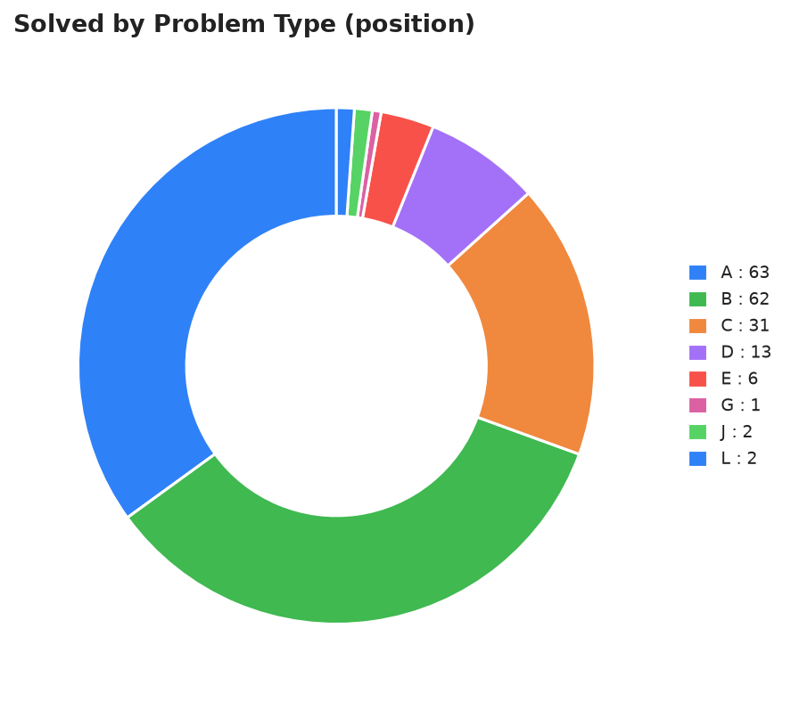

# CF Vault

Auto-generated archive of accepted Codeforces submissions for **[om_sharma_](https://codeforces.com/profile/om_sharma_)**.

- **Total solved:** 148
- **With source attached:** 0 / 148
- **Longest streak:** 15 days  |  **Current streak:** 0 days
- **Contest rating:** 990 (max 1294)

## 📊 Analytics

📋 Raw tables (language / rating / tag breakdown)

### By language

| Language | Solved |
|---|---|
| C++ | 148 |

### By rating

| Rating | Count |
|---|---|
| 0800 | 45 |
| 0900 | 24 |
| 1000 | 10 |
| 1100 | 16 |
| 1200 | 13 |
| 1300 | 13 |
| 1400 | 4 |
| 1500 | 9 |
| 1600 | 5 |
| 1700 | 5 |
| 1800 | 1 |
| Unrated | 3 |

### By tag

| Tag | Count |
|---|---|
| `greedy` | 70 |
| `math` | 67 |
| `implementation` | 40 |
| `brute force` | 35 |
| `constructive algorithms` | 21 |
| `number theory` | 20 |
| `sortings` | 20 |
| `dp` | 20 |
| `binary search` | 19 |
| `strings` | 18 |
| `data structures` | 13 |
| `two pointers` | 12 |
| `bitmasks` | 5 |
| `dfs and similar` | 5 |
| `combinatorics` | 5 |
| `geometry` | 4 |
| `ternary search` | 2 |
| `dsu` | 2 |
| `graphs` | 2 |
| `games` | 2 |
| `hashing` | 2 |
| `interactive` | 1 |
| `shortest paths` | 1 |
| `graph matchings` | 1 |
| `probabilities` | 1 |

## All problems

| # | Problem | Rating | Tags | Code | Link |
|---|---|---|---|---|---|
| 2257A | [Creating Abbreviations](problems/brute-force/Unrated_2257A-Creating-Abbreviations) | ? | `brute force`, `strings` | — | [CF](https://codeforces.com/contest/2257/problem/A) |
| 2257B | [Gigantomachy](problems/math/Unrated_2257B-Gigantomachy) | ? | `math` | — | [CF](https://codeforces.com/contest/2257/problem/B) |
| 2257D | [Bermuda Rectangle](problems/binary-search/Unrated_2257D-Bermuda-Rectangle) | ? | `binary search`, `implementation`, `math`, `number theory`, `two pointers` | — | [CF](https://codeforces.com/contest/2257/problem/D) |
| 4A | [Watermelon](problems/brute-force/0800_4A-Watermelon) | 800 | `brute force`, `math` | — | [CF](https://codeforces.com/contest/4/problem/A) |
| 14A | [Letter](problems/implementation/0800_14A-Letter) | 800 | `implementation` | — | [CF](https://codeforces.com/contest/14/problem/A) |
| 71A | [Way Too Long Words](problems/strings/0800_71A-Way-Too-Long-Words) | 800 | `strings` | — | [CF](https://codeforces.com/contest/71/problem/A) |
| 231A | [Team](problems/brute-force/0800_231A-Team) | 800 | `brute force`, `greedy` | — | [CF](https://codeforces.com/contest/231/problem/A) |
| 263A | [Beautiful Matrix](problems/implementation/0800_263A-Beautiful-Matrix) | 800 | `implementation` | — | [CF](https://codeforces.com/contest/263/problem/A) |
| 282A | [Bit++](problems/implementation/0800_282A-Bit) | 800 | `implementation` | — | [CF](https://codeforces.com/contest/282/problem/A) |
| 339A | [Helpful Maths](problems/greedy/0800_339A-Helpful-Maths) | 800 | `greedy`, `implementation`, `sortings`, `strings` | — | [CF](https://codeforces.com/contest/339/problem/A) |
| 617A | [Elephant](problems/math/0800_617A-Elephant) | 800 | `math` | — | [CF](https://codeforces.com/contest/617/problem/A) |
| 1459A | [Red-Blue Shuffle](problems/math/0800_1459A-Red-Blue-Shuffle) | 800 | `math`, `probabilities` | — | [CF](https://codeforces.com/contest/1459/problem/A) |
| 1493A | [Anti-knapsack](problems/constructive-algorithms/0800_1493A-Anti-knapsack) | 800 | `constructive algorithms`, `greedy` | — | [CF](https://codeforces.com/contest/1493/problem/A) |
| 1766A | [Extremely Round](problems/brute-force/0800_1766A-Extremely-Round) | 800 | `brute force`, `implementation` | — | [CF](https://codeforces.com/contest/1766/problem/A) |
| 1772A | [A+B?](problems/implementation/0800_1772A-AB) | 800 | `implementation` | — | [CF](https://codeforces.com/contest/1772/problem/A) |
| 1772B | [Matrix Rotation](problems/brute-force/0800_1772B-Matrix-Rotation) | 800 | `brute force`, `implementation` | — | [CF](https://codeforces.com/contest/1772/problem/B) |
| 1791C | [Prepend and Append](problems/implementation/0800_1791C-Prepend-and-Append) | 800 | `implementation`, `two pointers` | — | [CF](https://codeforces.com/contest/1791/problem/C) |
| 1814A | [Coins](problems/implementation/0800_1814A-Coins) | 800 | `implementation`, `math` | — | [CF](https://codeforces.com/contest/1814/problem/A) |
| 1833C | [Vlad Building Beautiful Array](problems/greedy/0800_1833C-Vlad-Building-Beautiful-Array) | 800 | `greedy`, `math` | — | [CF](https://codeforces.com/contest/1833/problem/C) |
| 1877A | [Goals of Victory](problems/math/0800_1877A-Goals-of-Victory) | 800 | `math` | — | [CF](https://codeforces.com/contest/1877/problem/A) |
| 1878A | [How Much Does Daytona Cost?](problems/greedy/0800_1878A-How-Much-Does-Daytona-Cost) | 800 | `greedy` | — | [CF](https://codeforces.com/contest/1878/problem/A) |
| 1878B | [Aleksa and Stack](problems/constructive-algorithms/0800_1878B-Aleksa-and-Stack) | 800 | `constructive algorithms`, `math` | — | [CF](https://codeforces.com/contest/1878/problem/B) |
| 1901A | [Line Trip](problems/greedy/0800_1901A-Line-Trip) | 800 | `greedy`, `math` | — | [CF](https://codeforces.com/contest/1901/problem/A) |
| 1903A | [Halloumi Boxes](problems/brute-force/0800_1903A-Halloumi-Boxes) | 800 | `brute force`, `greedy`, `sortings` | — | [CF](https://codeforces.com/contest/1903/problem/A) |
| 2151A | [Incremental Subarray](problems/math/0800_2151A-Incremental-Subarray) | 800 | `math`, `strings` | — | [CF](https://codeforces.com/contest/2151/problem/A) |
| 2182A | [New Year String](problems/constructive-algorithms/0800_2182A-New-Year-String) | 800 | `constructive algorithms`, `greedy`, `implementation`, `strings` | — | [CF](https://codeforces.com/contest/2182/problem/A) |
| 2182B | [New Year Cake](problems/brute-force/0800_2182B-New-Year-Cake) | 800 | `brute force` | — | [CF](https://codeforces.com/contest/2182/problem/B) |
| 2188A | [Divisible Permutation](problems/constructive-algorithms/0800_2188A-Divisible-Permutation) | 800 | `constructive algorithms` | — | [CF](https://codeforces.com/contest/2188/problem/A) |
| 2209A | [Flip Flops](problems/greedy/0800_2209A-Flip-Flops) | 800 | `greedy` | — | [CF](https://codeforces.com/contest/2209/problem/A) |
| 2233A | [AI Project Development](problems/brute-force/0800_2233A-AI-Project-Development) | 800 | `brute force`, `math` | — | [CF](https://codeforces.com/contest/2233/problem/A) |
| 2234A | [Euclid, Sequence and Two Numbers](problems/math/0800_2234A-Euclid-Sequence-and-Two-Numbers) | 800 | `math`, `number theory`, `sortings` | — | [CF](https://codeforces.com/contest/2234/problem/A) |
| 2234B | [Palindrome, Twelve and Two Terms](problems/brute-force/0800_2234B-Palindrome-Twelve-and-Two-Terms) | 800 | `brute force`, `constructive algorithms`, `math` | — | [CF](https://codeforces.com/contest/2234/problem/B) |
| 2236A | [Games on the Train](problems/greedy/0800_2236A-Games-on-the-Train) | 800 | `greedy`, `math` | — | [CF](https://codeforces.com/contest/2236/problem/A) |
| 2236B | [Tatar TV Show](problems/greedy/0800_2236B-Tatar-TV-Show) | 800 | `greedy`, `math`, `strings` | — | [CF](https://codeforces.com/contest/2236/problem/B) |
| 2238A | [Another Puzzle from Papyrus](problems/greedy/0800_2238A-Another-Puzzle-from-Papyrus) | 800 | `greedy`, `math`, `sortings` | — | [CF](https://codeforces.com/contest/2238/problem/A) |
| 2240A | [Another Popcount Problem](problems/greedy/0800_2240A-Another-Popcount-Problem) | 800 | `greedy` | — | [CF](https://codeforces.com/contest/2240/problem/A) |
| 2241A | [Divide and Conquer](problems/greedy/0800_2241A-Divide-and-Conquer) | 800 | `greedy`, `math`, `number theory` | — | [CF](https://codeforces.com/contest/2241/problem/A) |
| 2242A | [Bigrams](problems/sortings/0800_2242A-Bigrams) | 800 | `sortings`, `strings` | — | [CF](https://codeforces.com/contest/2242/problem/A) |
| 2244A | [Iskander and Drawings](problems/dp/0800_2244A-Iskander-and-Drawings) | 800 | `dp`, `games`, `greedy`, `strings` | — | [CF](https://codeforces.com/contest/2244/problem/A) |
| 2244B | [Nikita and Books](problems/greedy/0800_2244B-Nikita-and-Books) | 800 | `greedy`, `math`, `sortings` | — | [CF](https://codeforces.com/contest/2244/problem/B) |
| 2245A | [Who Watches the Watchpig?](problems/greedy/0800_2245A-Who-Watches-the-Watchpig) | 800 | `greedy` | — | [CF](https://codeforces.com/contest/2245/problem/A) |
| 2246A | [farmpiggie and Subset Sum](problems/constructive-algorithms/0800_2246A-farmpiggie-and-Subset-Sum) | 800 | `constructive algorithms` | — | [CF](https://codeforces.com/contest/2246/problem/A) |
| 2247A | [Zero Sum](problems/constructive-algorithms/0800_2247A-Zero-Sum) | 800 | `constructive algorithms`, `dp`, `number theory` | — | [CF](https://codeforces.com/contest/2247/problem/A) |
| 2248A | [You Delete, I Delete](problems/greedy/0800_2248A-You-Delete-I-Delete) | 800 | `greedy` | — | [CF](https://codeforces.com/contest/2248/problem/A) |
| 2252A | [Boss Fight](problems/data-structures/0800_2252A-Boss-Fight) | 800 | `data structures`, `greedy` | — | [CF](https://codeforces.com/contest/2252/problem/A) |
| 2253A | [The Best Card](problems/greedy/0800_2253A-The-Best-Card) | 800 | `greedy`, `math`, `number theory` | — | [CF](https://codeforces.com/contest/2253/problem/A) |
| 2254A | [Riptide](problems/implementation/0800_2254A-Riptide) | 800 | `implementation`, `sortings` | — | [CF](https://codeforces.com/contest/2254/problem/A) |
| 2256A | [Three Numbers on the Blackboard](problems/math/0800_2256A-Three-Numbers-on-the-Blackboard) | 800 | `math`, `sortings` | — | [CF](https://codeforces.com/contest/2256/problem/A) |
| 337A | [Puzzles](problems/greedy/0900_337A-Puzzles) | 900 | `greedy` | — | [CF](https://codeforces.com/contest/337/problem/A) |
| 1374B | [Multiply by 2, divide by 6](problems/math/0900_1374B-Multiply-by-2-divide-by-6) | 900 | `math` | — | [CF](https://codeforces.com/contest/1374/problem/B) |
| 1440B | [Sum of Medians](problems/greedy/0900_1440B-Sum-of-Medians) | 900 | `greedy`, `math` | — | [CF](https://codeforces.com/contest/1440/problem/B) |
| 1475A | [Odd Divisor](problems/math/0900_1475A-Odd-Divisor) | 900 | `math`, `number theory` | — | [CF](https://codeforces.com/contest/1475/problem/A) |
| 1537B | [Bad Boy](problems/constructive-algorithms/0900_1537B-Bad-Boy) | 900 | `constructive algorithms`, `greedy`, `math` | — | [CF](https://codeforces.com/contest/1537/problem/B) |
| 1593B | [Make it Divisible by 25](problems/dfs-and-similar/0900_1593B-Make-it-Divisible-by-25) | 900 | `dfs and similar`, `dp`, `greedy`, `math` | — | [CF](https://codeforces.com/contest/1593/problem/B) |
| 1606A | [AB Balance](problems/strings/0900_1606A-AB-Balance) | 900 | `strings` | — | [CF](https://codeforces.com/contest/1606/problem/A) |
| 1607B | [Odd Grasshopper](problems/math/0900_1607B-Odd-Grasshopper) | 900 | `math` | — | [CF](https://codeforces.com/contest/1607/problem/B) |
| 1624B | [Make AP](problems/implementation/0900_1624B-Make-AP) | 900 | `implementation`, `math` | — | [CF](https://codeforces.com/contest/1624/problem/B) |
| 1675B | [Make It Increasing](problems/greedy/0900_1675B-Make-It-Increasing) | 900 | `greedy`, `implementation` | — | [CF](https://codeforces.com/contest/1675/problem/B) |
| 1679A | [AvtoBus](problems/brute-force/0900_1679A-AvtoBus) | 900 | `brute force`, `greedy`, `math`, `number theory` | — | [CF](https://codeforces.com/contest/1679/problem/A) |
| 1696B | [NIT Destroys the Universe](problems/greedy/0900_1696B-NIT-Destroys-the-Universe) | 900 | `greedy` | — | [CF](https://codeforces.com/contest/1696/problem/B) |
| 1794B | [Not Dividing](problems/constructive-algorithms/0900_1794B-Not-Dividing) | 900 | `constructive algorithms`, `greedy`, `math` | — | [CF](https://codeforces.com/contest/1794/problem/B) |
| 1850D | [Balanced Round](problems/brute-force/0900_1850D-Balanced-Round) | 900 | `brute force`, `greedy`, `implementation`, `sortings` | — | [CF](https://codeforces.com/contest/1850/problem/D) |
| 1855B | [Longest Divisors Interval](problems/brute-force/0900_1855B-Longest-Divisors-Interval) | 900 | `brute force`, `combinatorics`, `greedy`, `math`, `number theory` | — | [CF](https://codeforces.com/contest/1855/problem/B) |
| 1875A | [Jellyfish and Undertale](problems/brute-force/0900_1875A-Jellyfish-and-Undertale) | 900 | `brute force`, `greedy` | — | [CF](https://codeforces.com/contest/1875/problem/A) |
| 1878C | [Vasilije in Cacak](problems/math/0900_1878C-Vasilije-in-Cacak) | 900 | `math` | — | [CF](https://codeforces.com/contest/1878/problem/C) |
| 1883B | [Chemistry](problems/strings/0900_1883B-Chemistry) | 900 | `strings` | — | [CF](https://codeforces.com/contest/1883/problem/B) |
| 1904A | [Forked!](problems/brute-force/0900_1904A-Forked) | 900 | `brute force`, `implementation` | — | [CF](https://codeforces.com/contest/1904/problem/A) |
| 2195B | [Heapify 1](problems/implementation/0900_2195B-Heapify-1) | 900 | `implementation`, `sortings` | — | [CF](https://codeforces.com/contest/2195/problem/B) |
| 2210B | [Simply Sitting on Chairs](problems/data-structures/0900_2210B-Simply-Sitting-on-Chairs) | 900 | `data structures`, `greedy` | — | [CF](https://codeforces.com/contest/2210/problem/B) |
| 2238B | [Crimson Triples](problems/dp/0900_2238B-Crimson-Triples) | 900 | `dp`, `math`, `number theory` | — | [CF](https://codeforces.com/contest/2238/problem/B) |
| 2246B | [ezraft and Array](problems/constructive-algorithms/0900_2246B-ezraft-and-Array) | 900 | `constructive algorithms`, `number theory` | — | [CF](https://codeforces.com/contest/2246/problem/B) |
| 2254B | [Evanescent](problems/implementation/0900_2254B-Evanescent) | 900 | `implementation`, `strings`, `two pointers` | — | [CF](https://codeforces.com/contest/2254/problem/B) |
| 1A | [Theatre Square](problems/math/1000_1A-Theatre-Square) | 1000 | `math` | — | [CF](https://codeforces.com/contest/1/problem/A) |
| 14B | [Young Photographer](problems/implementation/1000_14B-Young-Photographer) | 1000 | `implementation` | — | [CF](https://codeforces.com/contest/14/problem/B) |
| 43A | [Football](problems/strings/1000_43A-Football) | 1000 | `strings` | — | [CF](https://codeforces.com/contest/43/problem/A) |
| 1784A | [Monsters (easy version)](problems/brute-force/1000_1784A-Monsters-easy-version) | 1000 | `brute force`, `greedy` | — | [CF](https://codeforces.com/contest/1784/problem/A) |
| 1883C | [Raspberries](problems/dp/1000_1883C-Raspberries) | 1000 | `dp`, `math` | — | [CF](https://codeforces.com/contest/1883/problem/C) |
| 1913B | [Swap and Delete](problems/strings/1000_1913B-Swap-and-Delete) | 1000 | `strings` | — | [CF](https://codeforces.com/contest/1913/problem/B) |
| 2193C | [Replace and Sum](problems/data-structures/1000_2193C-Replace-and-Sum) | 1000 | `data structures`, `greedy` | — | [CF](https://codeforces.com/contest/2193/problem/C) |
| 2236C | [Omsk Programmers](problems/brute-force/1000_2236C-Omsk-Programmers) | 1000 | `brute force`, `greedy`, `math` | — | [CF](https://codeforces.com/contest/2236/problem/C) |
| 2241C | [RemovevomeR](problems/greedy/1000_2241C-RemovevomeR) | 1000 | `greedy` | — | [CF](https://codeforces.com/contest/2241/problem/C) |
| 2242B | [Predominant Frequency Division](problems/data-structures/1000_2242B-Predominant-Frequency-Division) | 1000 | `data structures`, `greedy`, `implementation`, `math` | — | [CF](https://codeforces.com/contest/2242/problem/B) |
| 919B | [Perfect Number](problems/binary-search/1100_919B-Perfect-Number) | 1100 | `binary search`, `brute force`, `dp`, `implementation`, `number theory` | — | [CF](https://codeforces.com/contest/919/problem/B) |
| 1708B | [Difference of GCDs](problems/constructive-algorithms/1100_1708B-Difference-of-GCDs) | 1100 | `constructive algorithms`, `math` | — | [CF](https://codeforces.com/contest/1708/problem/B) |
| 1826B | [Lunatic Never Content](problems/math/1100_1826B-Lunatic-Never-Content) | 1100 | `math`, `number theory` | — | [CF](https://codeforces.com/contest/1826/problem/B) |
| 1899B | [250 Thousand Tons of TNT](problems/brute-force/1100_1899B-250-Thousand-Tons-of-TNT) | 1100 | `brute force`, `implementation`, `number theory` | — | [CF](https://codeforces.com/contest/1899/problem/B) |
| 1914C | [Quests](problems/greedy/1100_1914C-Quests) | 1100 | `greedy`, `math` | — | [CF](https://codeforces.com/contest/1914/problem/C) |
| 1942B | [Bessie and MEX](problems/constructive-algorithms/1100_1942B-Bessie-and-MEX) | 1100 | `constructive algorithms`, `math` | — | [CF](https://codeforces.com/contest/1942/problem/B) |
| 2063B | [Subsequence Update](problems/constructive-algorithms/1100_2063B-Subsequence-Update) | 1100 | `constructive algorithms`, `data structures`, `greedy`, `sortings` | — | [CF](https://codeforces.com/contest/2063/problem/B) |
| 2065C1 | [Skibidus and Fanum Tax (easy version)](problems/binary-search/1100_2065C1-Skibidus-and-Fanum-Tax-easy-version) | 1100 | `binary search`, `dp`, `greedy` | — | [CF](https://codeforces.com/contest/2065/problem/C1) |
| 2169B | [Drifting Away](problems/greedy/1100_2169B-Drifting-Away) | 1100 | `greedy`, `implementation` | — | [CF](https://codeforces.com/contest/2169/problem/B) |
| 2240B | [AI Finds Nothing Here](problems/combinatorics/1100_2240B-AI-Finds-Nothing-Here) | 1100 | `combinatorics`, `math` | — | [CF](https://codeforces.com/contest/2240/problem/B) |
| 2241D | [An Alternative Way](problems/dp/1100_2241D-An-Alternative-Way) | 1100 | `dp`, `greedy`, `math` | — | [CF](https://codeforces.com/contest/2241/problem/D) |
| 2241B | [Good times Good times](problems/constructive-algorithms/1100_2241B-Good-times-Good-times) | 1100 | `constructive algorithms`, `dfs and similar`, `math` | — | [CF](https://codeforces.com/contest/2241/problem/B) |
| 2244C | [Stepan and Permutation](problems/constructive-algorithms/1100_2244C-Stepan-and-Permutation) | 1100 | `constructive algorithms`, `dfs and similar`, `dsu`, `greedy`, `math`, `number theory`, `sortings` | — | [CF](https://codeforces.com/contest/2244/problem/C) |
| 2245B | [Delete and Concatenate](problems/greedy/1100_2245B-Delete-and-Concatenate) | 1100 | `greedy` | — | [CF](https://codeforces.com/contest/2245/problem/B) |
| 2252B | [Always Changing](problems/dp/1100_2252B-Always-Changing) | 1100 | `dp`, `greedy`, `math`, `strings` | — | [CF](https://codeforces.com/contest/2252/problem/B) |
| 2253B | [Hypercarp and the Control Panel](problems/brute-force/1100_2253B-Hypercarp-and-the-Control-Panel) | 1100 | `brute force`, `data structures`, `two pointers` | — | [CF](https://codeforces.com/contest/2253/problem/B) |
| 961B | [Lecture Sleep](problems/data-structures/1200_961B-Lecture-Sleep) | 1200 | `data structures`, `dp`, `implementation`, `two pointers` | — | [CF](https://codeforces.com/contest/961/problem/B) |
| 1076B | [Divisor Subtraction](problems/implementation/1200_1076B-Divisor-Subtraction) | 1200 | `implementation`, `math`, `number theory` | — | [CF](https://codeforces.com/contest/1076/problem/B) |
| 1272C | [Yet Another Broken Keyboard](problems/combinatorics/1200_1272C-Yet-Another-Broken-Keyboard) | 1200 | `combinatorics`, `dp`, `implementation` | — | [CF](https://codeforces.com/contest/1272/problem/C) |
| 1546B | [AquaMoon and Stolen String](problems/interactive/1200_1546B-AquaMoon-and-Stolen-String) | 1200 | `interactive`, `math` | — | [CF](https://codeforces.com/contest/1546/problem/B) |
| 1613C | [Poisoned Dagger](problems/binary-search/1200_1613C-Poisoned-Dagger) | 1200 | `binary search` | — | [CF](https://codeforces.com/contest/1613/problem/C) |
| 1832C | [Contrast Value](problems/greedy/1200_1832C-Contrast-Value) | 1200 | `greedy`, `implementation` | — | [CF](https://codeforces.com/contest/1832/problem/C) |
| 1925B | [A Balanced Problemset?](problems/brute-force/1200_1925B-A-Balanced-Problemset) | 1200 | `brute force`, `greedy`, `math`, `number theory` | — | [CF](https://codeforces.com/contest/1925/problem/B) |
| 2041E | [Beautiful Array](problems/constructive-algorithms/1200_2041E-Beautiful-Array) | 1200 | `constructive algorithms`, `math` | — | [CF](https://codeforces.com/contest/2041/problem/E) |
| 2048C | [Kevin and Binary Strings](problems/bitmasks/1200_2048C-Kevin-and-Binary-Strings) | 1200 | `bitmasks`, `brute force`, `greedy`, `implementation`, `strings` | — | [CF](https://codeforces.com/contest/2048/problem/C) |
| 2051D | [Counting Pairs](problems/binary-search/1200_2051D-Counting-Pairs) | 1200 | `binary search`, `sortings`, `two pointers` | — | [CF](https://codeforces.com/contest/2051/problem/D) |
| 2053B | [Outstanding Impressionist](problems/binary-search/1200_2053B-Outstanding-Impressionist) | 1200 | `binary search`, `brute force`, `data structures`, `greedy` | — | [CF](https://codeforces.com/contest/2053/problem/B) |
| 2109B | [Slice to Survive](problems/bitmasks/1200_2109B-Slice-to-Survive) | 1200 | `bitmasks`, `greedy`, `math` | — | [CF](https://codeforces.com/contest/2109/problem/B) |
| 2244D | [Yaroslav and Productivity](problems/constructive-algorithms/1200_2244D-Yaroslav-and-Productivity) | 1200 | `constructive algorithms`, `dp`, `greedy`, `math`, `number theory` | — | [CF](https://codeforces.com/contest/2244/problem/D) |
| 4C | [Registration System](problems/data-structures/1300_4C-Registration-System) | 1300 | `data structures`, `hashing`, `implementation` | — | [CF](https://codeforces.com/contest/4/problem/C) |
| 230B | [T-primes](problems/binary-search/1300_230B-T-primes) | 1300 | `binary search`, `implementation`, `math`, `number theory` | — | [CF](https://codeforces.com/contest/230/problem/B) |
| 665C | [Simple Strings](problems/dp/1300_665C-Simple-Strings) | 1300 | `dp`, `greedy`, `strings` | — | [CF](https://codeforces.com/contest/665/problem/C) |
| 1424G | [Years](problems/data-structures/1300_1424G-Years) | 1300 | `data structures`, `sortings` | — | [CF](https://codeforces.com/contest/1424/problem/G) |
| 1476B | [Inflation](problems/binary-search/1300_1476B-Inflation) | 1300 | `binary search`, `brute force`, `greedy`, `math` | — | [CF](https://codeforces.com/contest/1476/problem/B) |
| 1661B | [Getting Zero](problems/bitmasks/1300_1661B-Getting-Zero) | 1300 | `bitmasks`, `brute force`, `dfs and similar`, `dp`, `graphs`, `greedy`, `shortest paths` | — | [CF](https://codeforces.com/contest/1661/problem/B) |
| 1899D | [Yarik and Musical Notes](problems/hashing/1300_1899D-Yarik-and-Musical-Notes) | 1300 | `hashing`, `math`, `number theory` | — | [CF](https://codeforces.com/contest/1899/problem/D) |
| 1913C | [Game with Multiset](problems/binary-search/1300_1913C-Game-with-Multiset) | 1300 | `binary search`, `bitmasks`, `brute force`, `greedy` | — | [CF](https://codeforces.com/contest/1913/problem/C) |
| 2041A | [The Bento Box Adventure](problems/implementation/1300_2041A-The-Bento-Box-Adventure) | 1300 | `implementation`, `sortings` | — | [CF](https://codeforces.com/contest/2041/problem/A) |
| 2049B | [pspspsps](problems/brute-force/1300_2049B-pspspsps) | 1300 | `brute force`, `constructive algorithms`, `graph matchings`, `implementation` | — | [CF](https://codeforces.com/contest/2049/problem/B) |
| 2116B | [Gellyfish and Baby's Breath](problems/greedy/1300_2116B-Gellyfish-and-Babys-Breath) | 1300 | `greedy`, `math`, `sortings` | — | [CF](https://codeforces.com/contest/2116/problem/B) |
| 2240C | [Nim Game Is XOR Game](problems/games/1300_2240C-Nim-Game-Is-XOR-Game) | 1300 | `games`, `greedy` | — | [CF](https://codeforces.com/contest/2240/problem/C) |
| 2242C | [Unstable Elements](problems/brute-force/1300_2242C-Unstable-Elements) | 1300 | `brute force`, `data structures`, `implementation`, `sortings`, `two pointers` | — | [CF](https://codeforces.com/contest/2242/problem/C) |
| 279B | [Books](problems/binary-search/1400_279B-Books) | 1400 | `binary search`, `brute force`, `implementation`, `two pointers` | — | [CF](https://codeforces.com/contest/279/problem/B) |
| 2038L | [Bridge Renovation](problems/brute-force/1400_2038L-Bridge-Renovation) | 1400 | `brute force`, `dp`, `greedy`, `math`, `two pointers` | — | [CF](https://codeforces.com/contest/2038/problem/L) |
| 2038C | [DIY](problems/data-structures/1400_2038C-DIY) | 1400 | `data structures`, `geometry`, `greedy`, `sortings` | — | [CF](https://codeforces.com/contest/2038/problem/C) |
| 2045C | [Saraga](problems/greedy/1400_2045C-Saraga) | 1400 | `greedy`, `strings` | — | [CF](https://codeforces.com/contest/2045/problem/C) |
| 545C | [Woodcutters](problems/dp/1500_545C-Woodcutters) | 1500 | `dp`, `greedy` | — | [CF](https://codeforces.com/contest/545/problem/C) |
| 702C | [Cellular Network](problems/binary-search/1500_702C-Cellular-Network) | 1500 | `binary search`, `implementation`, `two pointers` | — | [CF](https://codeforces.com/contest/702/problem/C) |
| 1575J | [Jeopardy of Dropped Balls](problems/binary-search/1500_1575J-Jeopardy-of-Dropped-Balls) | 1500 | `binary search`, `brute force`, `dsu`, `implementation` | — | [CF](https://codeforces.com/contest/1575/problem/J) |
| 1776L | [Controllers](problems/binary-search/1500_1776L-Controllers) | 1500 | `binary search`, `math` | — | [CF](https://codeforces.com/contest/1776/problem/L) |
| 1933E | [Turtle vs. Rabbit Race: Optimal Trainings](problems/binary-search/1500_1933E-Turtle-vs.-Rabbit-Race-Optimal-Trainings) | 1500 | `binary search`, `implementation`, `math`, `ternary search` | — | [CF](https://codeforces.com/contest/1933/problem/E) |
| 2050E | [Three Strings](problems/dp/1500_2050E-Three-Strings) | 1500 | `dp`, `implementation`, `strings` | — | [CF](https://codeforces.com/contest/2050/problem/E) |
| 2072E | [Do You Love Your Hero and His Two-Hit Multi-Target Attacks?](problems/binary-search/1500_2072E-Do-You-Love-Your-Hero-and-His-Two-Hit-Multi-Target-Attacks) | 1500 | `binary search`, `brute force`, `constructive algorithms`, `dp`, `geometry`, `greedy`, `math` | — | [CF](https://codeforces.com/contest/2072/problem/E) |
| 2238D | [Storming Arasaka](problems/greedy/1500_2238D-Storming-Arasaka) | 1500 | `greedy`, `math`, `number theory` | — | [CF](https://codeforces.com/contest/2238/problem/D) |
| 2240D | [Decidophobia](problems/greedy/1500_2240D-Decidophobia) | 1500 | `greedy`, `sortings` | — | [CF](https://codeforces.com/contest/2240/problem/D) |
| 150B | [Quantity of Strings](problems/combinatorics/1600_150B-Quantity-of-Strings) | 1600 | `combinatorics`, `dfs and similar`, `graphs`, `math` | — | [CF](https://codeforces.com/contest/150/problem/B) |
| 1610C | [Keshi Is Throwing a Party](problems/binary-search/1600_1610C-Keshi-Is-Throwing-a-Party) | 1600 | `binary search`, `greedy` | — | [CF](https://codeforces.com/contest/1610/problem/C) |
| 1730B | [Meeting on the Line](problems/binary-search/1600_1730B-Meeting-on-the-Line) | 1600 | `binary search`, `geometry`, `greedy`, `implementation`, `math`, `ternary search` | — | [CF](https://codeforces.com/contest/1730/problem/B) |
| 2040C | [Ordered Permutations](problems/bitmasks/1600_2040C-Ordered-Permutations) | 1600 | `bitmasks`, `combinatorics`, `constructive algorithms`, `greedy`, `math`, `two pointers` | — | [CF](https://codeforces.com/contest/2040/problem/C) |
| 2048D | [Kevin and Competition Memories](problems/binary-search/1600_2048D-Kevin-and-Competition-Memories) | 1600 | `binary search`, `brute force`, `data structures`, `greedy`, `sortings`, `two pointers` | — | [CF](https://codeforces.com/contest/2048/problem/D) |
| 14C | [Four Segments](problems/brute-force/1700_14C-Four-Segments) | 1700 | `brute force`, `constructive algorithms`, `geometry`, `implementation`, `math` | — | [CF](https://codeforces.com/contest/14/problem/C) |
| 474D | [Flowers](problems/dp/1700_474D-Flowers) | 1700 | `dp` | — | [CF](https://codeforces.com/contest/474/problem/D) |
| 2045A | [Scrambled Scrabble](problems/brute-force/1700_2045A-Scrambled-Scrabble) | 1700 | `brute force`, `greedy` | — | [CF](https://codeforces.com/contest/2045/problem/A) |
| 2206J | [Worldwide Playlist](problems/math/1700_2206J-Worldwide-Playlist) | 1700 | `math` | — | [CF](https://codeforces.com/contest/2206/problem/J) |
| 2236E | [Friendly Gifts](problems/brute-force/1700_2236E-Friendly-Gifts) | 1700 | `brute force`, `dp` | — | [CF](https://codeforces.com/contest/2236/problem/E) |
| 2106E | [Wolf](problems/binary-search/1800_2106E-Wolf) | 1800 | `binary search`, `greedy`, `math` | — | [CF](https://codeforces.com/contest/2106/problem/E) |